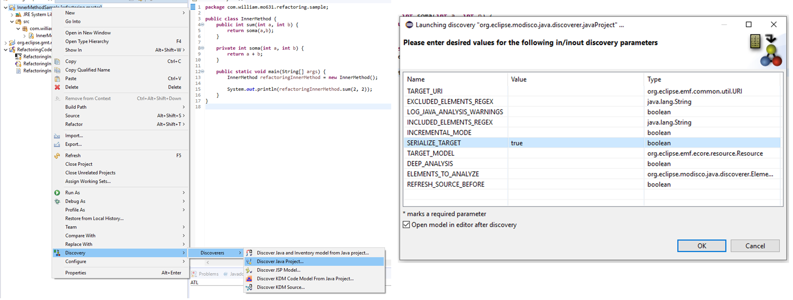
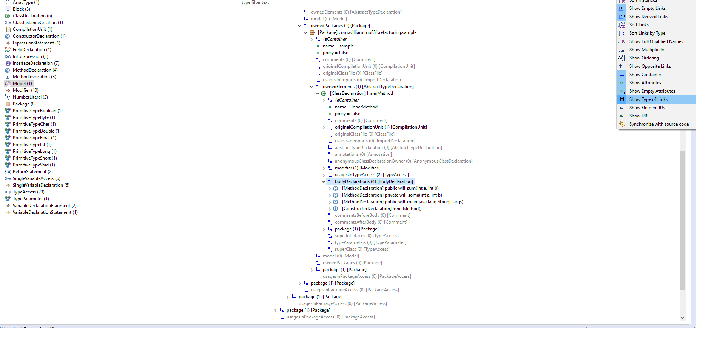
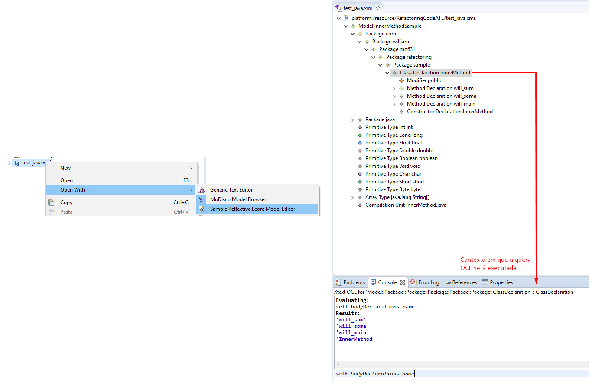
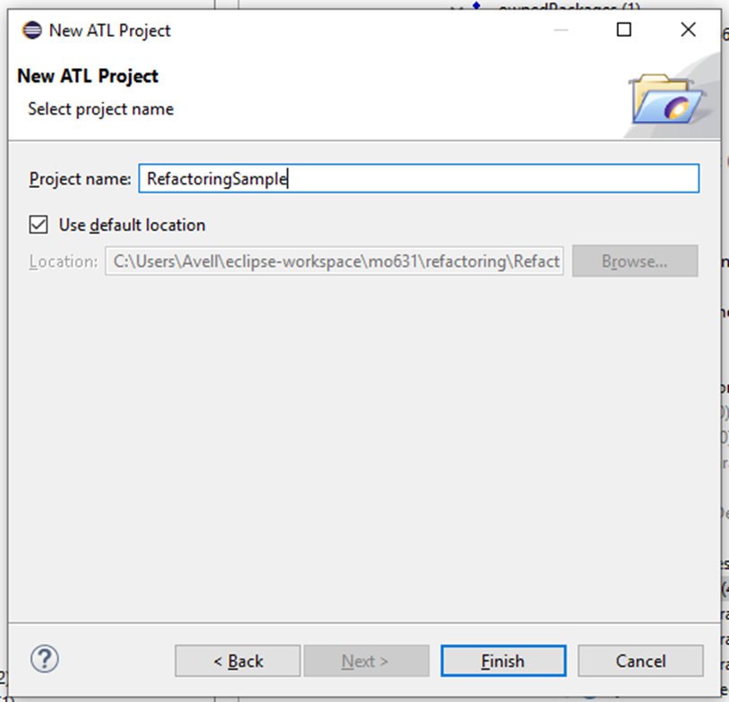
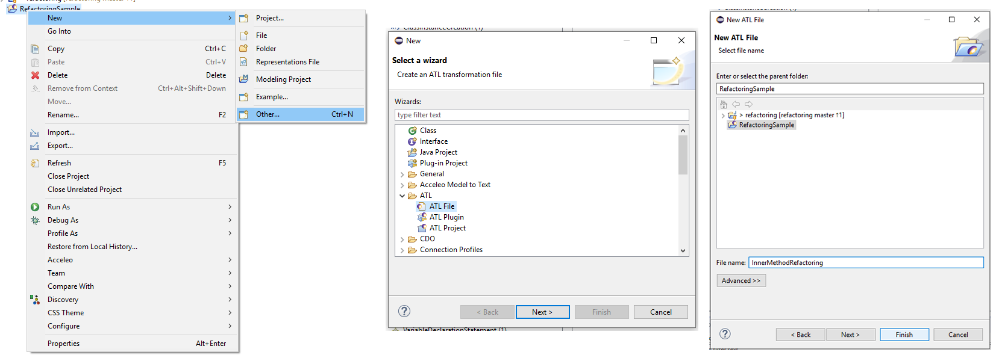
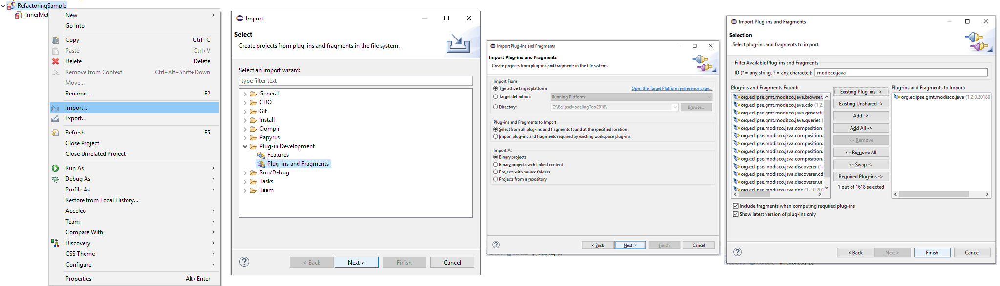

Os projetos presentes neste repositório visam demonstrar o processo de geração automática de refactorings utilizando MoDisco e ATL.

Para tal, é apresentado nesse readme um tutorial passo a passo, de como criar tal solução.

Itens necessários para execução dos projetos:

* Eclipse 2019-09 (4.13.0)
* MoDisco (1.2.0.201805182005)
  * É provável que ao tentar instalar o MoDisco através do gerenciador de plugins do Eclipse você obtenha um erro. Se assim for, utilize os links abaixo para a instalação.
    * http://download.eclipse.org/facet/updates/release/1.3.0/
    * http://download.eclipse.org/modeling/mdt/modisco/updates/release/1.2.0/
* ATL (4.1.0.v201909021645) - _Disponível nos plugins de modelagem do Eclipse_

## Como gerar um modelo Java a partir do MoDisco

Nesta seção do documento é descrito como gerar um modelo (Java) a partir de um projeto também implementado utilizando Java.

Para obter um modelo para sua aplicação Java siga os seguintes passos:

​	Botão direito sobre o projeto Java > Discoveres > Discover Java Project... > Sete a flag _SERIALIZE_TARGET_ 
​	para _true_

_Figura 1 - Como gerar modelo Java e configuração do MoDisco_

Uma vez gerado o modelo, é possível navegar entre os objetos através da visualização fornecida pelo MoDisco, e também é possível personalizar os dados a serem exibidos em tal visualização, adicionando por exemplo os tipos dos elementos.

_Figura 2 - Visualização do modelo gerado e personalização para exibir o tipo dos elementos_

A partir do modelo gerado pelo MoDisco é possível utilizar consultas OCL para navegar entre os elementos do projeto.

Para tal, abra o modelo gerado utilizando a perspectiva *Sample Reflective Ecore Model Editor*, abra o Console do *Xtext OCL* e execute as queries conforme desejar. 

_Figura 3 - Executando consultas OCL_

## Adicionando projeto ATL

O projeto ATL é o responsável por executar as transformações no modelo Java extraído através do MoDisco. É através dele que serão aplicados os refactorings no código.

Para adicionar um projeto ATL siga os seguintes passos:

​	File > New > Project > ATL > ATL Project > Dê um nome para seu projeto e clique em _Finish_

_Figura 4 - Criando projeto ATL_

Uma vez criado o projeto é necessário adicionar o arquivo ATL responsável pelas transformações no modelo.

​	Botão direito sobre o projeto > New > Other > ATL > ATL file > Coloque um nome ao seu arquivo e clique 	em _Finish_

_Figura 5 - Adicionando arquivo ATL_

O projeto estará com erro. Para corrigir é necessário fazer algumas alterações no arquivo ATL indicando qual a transformação é desejada. Para fazer isso, primeiro é necessário adicionar a referência ao metamodelo do Java utilizado pelo MoDisco.

​        Botão direito sobre o projeto > Import > Plug-in Development > Plug-ins and Fragments > Clique no 		botão _Next_ > Clique novamente em _Next_ > Filtre por _modisco.java_ > selecione o plugin:
​		_org.eclipse.gmt.modisco.java.browser.customization_ > Clique em _Add_ > Clique em _Finish_

_Figura 6 - Adicionando referência ao plugin do MoDisco_