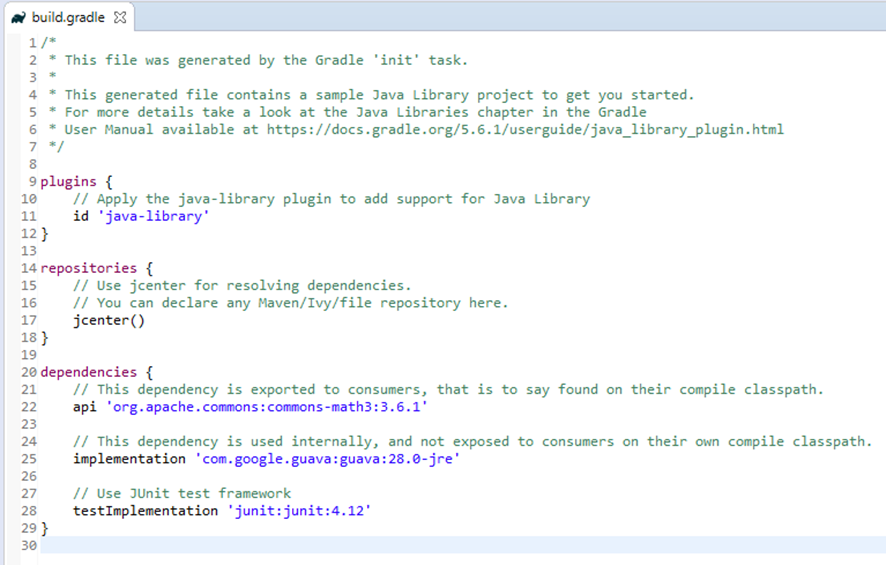

Os projetos presentes neste repositório visam demonstrar o processo de geração automática de refactorings utilizando MoDisco e ATL.


Para tal, é apresentado nesse readme um tutorial passo a passo, de como criar tal solução.


Itens necessários para execução dos projetos:

* Eclipse 2019-09 (4.13.0)
* MoDisco (1.2.0.201805182005)
  * É provável que ao tentar instalar o MoDisco através do gerenciador de plugins do Eclipse você obtenha um erro. Se assim for, utilize os links abaixo para a instalação.
    * http://download.eclipse.org/facet/updates/release/1.3.0/
    * http://download.eclipse.org/modeling/mdt/modisco/updates/release/1.2.0/
* ATL (4.1.0.v201909021645) - _Disponível nos plugins de modelagem do Eclipse_


## Como gerar um modelo Java a partir do MoDisco

Nesta seção do documento é descrito como gerar um modelo (Java) a partir de um projeto também implementado utilizando Java.

Para obter um modelo para sua aplicação Java siga os seguintes passos:

​	Botão direito sobre o projeto Java > Discoveres > Discover Java Project... > Sete a flag _SERIALIZE_TARGET_ 
​	para _true_


_Figura 1 - Como gerar modelo Java e configuração do MoDisco_


Uma vez gerado o modelo, é possível navegar entre os objetos através da visualização fornecida pelo MoDisco, e também é possível personalizar os dados a serem exibidos em tal visualização, adicionando por exemplo os tipos dos elementos.


_Figura 2 - Visualização do modelo gerado e personalização para exibir o tipo dos elementos_

A partir do modelo gerado pelo MoDisco é possível utilizar consultas OCL para navegar entre os elementos do projeto.

Para tal, abra o modelo gerado utilizando a perspectiva *Sample Reflective Ecore Model Editor*, abra o Console do *Xtext OCL* e execute as queries conforme desejar. 


_Figura 3 - Executando consultas OCL_


## Adicionando projeto ATL

O projeto ATL é o responsável por executar as transformações no modelo Java extraído através do MoDisco. É através dele que serão aplicados os refactorings no código.


Para adicionar um projeto ATL siga os seguintes passos:

​	File > New > Project > ATL > ATL Project > Dê um nome para seu projeto e clique em _Finish_


_Figura 4 - Criando projeto ATL_


Uma vez criado o projeto é necessário adicionar o arquivo ATL responsável pelas transformações no modelo.


​	Botão direito sobre o projeto > New > Other > ATL > ATL file > Coloque um nome ao seu arquivo e clique 	em _Finish_


_Figura 5 - Adicionando arquivo ATL_


O projeto estará com erro. Para corrigir é necessário fazer algumas alterações no arquivo ATL indicando qual a transformação é desejada. Para fazer isso, primeiro é necessário adicionar a referência ao metamodelo do Java utilizado pelo MoDisco.

​        Botão direito sobre o projeto > Import > Plug-in Development > Plug-ins and Fragments > Clique no 		botão _Next_ > Clique novamente em _Next_ > Filtre por _modisco.java_ > selecione o plugin:
​		_org.eclipse.gmt.modisco.java.browser.customization_ > Clique em _Add_ > Clique em _Finish_


_Figura 6 - Adicionando referência ao plugin do MoDisco_


Após a adição de tal dependência, o projeto ainda estará com erro, portanto é necessário configurar o arquivo ATL com as transformações desejadas.

Abra o arquivo ATL adicionado e insira as seguintes informações:

**-- @atl2010** > indica o compilador ATL a ser utilizado

**-- @path Java=/org.eclipse.gmt.modisco.java/model/java.ecore** > Indica o caminho do metamodelo a ser utilizado nas transformações (*java.ecore*) e atribui um apelido ao mesmo (*Java*).

**create OUT: Java refining IN: Java;** > indica que a transformação ocorrerá do modelo de entrada específico (IN: Java) para o modelo de saída específico (OUT: Java). Como o projeto visa criar refactorings, utilizamos a modo de refinamento (refining), dessa forma somente serão alterados os elementos que sofrerem alguma alteração durante o processo de transformação M2M. 

**Obs.:** Somente é possível usar o modo de refinamento se o modelo de entrada e o modelo de saída são os mesmos.


_Figura 7 - Arquivo ATL_


Afim de terminar a preparação do ambiente, faz-se necessária a configuração de execução do mesmo, para isto siga os seguintes passos:

​        Botão direito sobre o projeto ATL > Run As > Run Configurations... > Duplo clique sobre ATL
​		Transformation > Renomeie a configuração > Clique em workspace e selecione seu projeto > 
​		Clique em _Ok_


_Figura 8 - Configurando execução do projeto ATL (1)_


Note que tanto em *Source Models* quanto em *Target Models*, será apresentado o modelo o qual a transformação deve ser conforme, no caso desse projeto o metamodelo Java definido pelo MoDisco.

Para finalizar a configuração, é necessário inserir o XMI a ser transformado e também o XMI a ser gerado. Assim sendo, siga os passos a seguir:

​        Source Models > IN: > Selecione o arquivo gerado a partir do MoDisco


_Figura 9 - Configurando execução do projeto ATL (2)_

​        Target Models > OUT: > Selecione o local onde será gerado o arquivo resultante da transformação > Dê um nome para o arquivo resultante, sendo que o final **necessariamente deve ser** _java.xmi (sufixo utilizado pelo MoDisco para reconhecer e gerar novamente o código resultante da transformação).


_Figura 10 - Configurando execução do projeto ATL (3)_

Após os passos descritos acima, o projeto já não apresentará erros, porém ainda não faz nenhuma transformação, uma vez que não há nenhuma tarefa no arquivo ATL para realizar tal tarefa, assim sendo nos resta adicionar as funções para realizar de fato o refactoring do código.


##### Adicionando transformações ATL

No arquivo ATL é possível definir tarefas para realizar quaisquer mudanças no metamodelo desde que tais mudanças respeitem as definições do mesmo. Abaixo estão representadas as tarefas responsáveis por alterar a visibilidade de membros de uma classe para privado e também adicionar os getters para tais elementos.

```ATL
-- @atlcompiler atl2010
-- @path Java=/org.eclipse.gmt.modisco.java/model/java.ecore


module Refactoring;
create OUT: Java refining IN: Java;

helper context Java!FieldDeclaration def: hasGetter() : Boolean = 
	self.abstractTypeDeclaration.bodyDeclarations
	->select(d | d.oclIsTypeOf(Java!MethodDeclaration))
	->select(md | md.name.startsWith(
		let fieldName : String = self.fragments->first().name 
		in
			'get' + fieldName.substring(1,1).toUpper() + fieldName.substring(2,fieldName.size())
		))
	->notEmpty();

helper context String def: firstToUpper() : String =
	self.substring(1, 1).toUpper() + self.substring(2, self.size());

rule CreateGetter{
	from
		field : Java!FieldDeclaration(
			not field.hasGetter()	
		)
	to
		-- Change member visibility - public to private
		updatedField: Java!FieldDeclaration(
			modifier <- fieldModifier
		),
		fieldModifier : Java!Modifier (
			visibility <- #private	
		),
		
		-- Generate getter
		getter : Java!MethodDeclaration (
			abstractTypeDeclaration <- field.abstractTypeDeclaration,
			originalCompilationUnit <- field.originalCompilationUnit,
			name <- 'get' + field.fragments->first().name.firstToUpper(),
			modifier <- getterModifier,
			returnType <- getterReturnType,
			body <- getterBlock
		),
		getterModifier : Java!Modifier (
			visibility <- #public	
		),
		getterReturnType : Java!TypeAccess (
			type <- if not field.type.oclIsUndefined() then
						field.type.type
					else
						OclUndefined
					endif
		),
		getterBlock : Java!Block (
			originalCompilationUnit <- field.originalCompilationUnit,
			statements <- Sequence{getterBlockReturnStatement}
		),
		getterBlockReturnStatement : Java!ReturnStatement (
			originalCompilationUnit <- field.originalCompilationUnit,
			expression <- getReturnExpression
		),
		getReturnExpression : Java!FieldAccess (
			originalCompilationUnit <- field.originalCompilationUnit,
			field <- getStringVariableAccess,
			expression <- getExpression
		),
		getStringVariableAccess : Java!SingleVariableAccess (
			variable <- field.fragments->first()	
		),
		getExpression : Java!ThisExpression (
			originalCompilationUnit <- field.originalCompilationUnit
		)
}
```


## Regerar código Java após a aplicação do refactoring

Afim de facilitar o processo de gerência de dependências, foi utilizado o Gradle para a geração do projeto responsável por gerar o código Java novamente.

_**OBS.:** Caso você não tenha o Gradle instalado em seu Eclipse, é possível fazer a instalação do mesmo através do gerenciador de plugins do Eclipse._

​	File > New > Other > Gradle Project > Clique em _Next_ > Novamente clique em _Next_ > Dê um nome ao seu
​	projeto > clique em _Finish_


_Figura 11 - Criando projeto Gradle_


O projeto Gradle já será criado com a dependência do projeto _Guava_ fornecido pelo Google, porém caso não haja tal dependência explícita em seu projeto, apenas adicione-a.

Seu arquivo de dependências deverá ser parecido com o demostrado na Figura 12.



Figura 12 - Arquivo de dependências build.gradle

 

Assim como foi feito no projeto ATL, é necessário adicionar os plugins do MoDisco ao projeto que estamos criando agora para recriar o código Java. Os plugins a serem adicionados são:

* org.eclipse.gmt.modisco.java.generation

* org.eclipse.modisco.util.emf.core 

_**OBS.:** O passo-a-passo sobre como importar plugins a um projeto no eclipse pode ser visto na Figura 6, por isso não está explícito aqui novamente._

Após adicionar todas as dependências, vamos implementar a classe Java responsável por gerar o código após o refactoring ser aplicado. A classe deve seguir o modelo apresentado a seguir.

```java
package com.william.mo631.generator;

import java.io.File;
import java.io.IOException;
import java.util.ArrayList;

import org.eclipse.emf.common.util.URI;
import org.eclipse.emf.ecore.EPackage;
import org.eclipse.emf.ecore.resource.Resource;
import org.eclipse.emf.ecore.xmi.XMIResource;
import org.eclipse.emf.ecore.xmi.impl.XMIResourceFactoryImpl;
import org.eclipse.emf.ecore.xmi.impl.XMIResourceImpl;
import org.eclipse.gmt.modisco.java.emf.JavaPackage;
import org.eclipse.gmt.modisco.java.generation.files.GenerateJavaExtended;

public class Generation {

	public static void main(String[] args) throws IOException {
		EPackage.Registry.INSTANCE.put(JavaPackage.eNS_URI, JavaPackage.eINSTANCE);

		XMIResourceFactoryImpl xmiResourceFactoryImpl = new XMIResourceFactoryImpl() {
			public Resource createResource(URI uri) {
				XMIResource xmiResource = new XMIResourceImpl();
				return xmiResource;
			}
		};

		Resource.Factory.Registry.INSTANCE.getExtensionToFactoryMap().put("xmi", xmiResourceFactoryImpl);

		GenerateJavaExtended javaGenerator = new GenerateJavaExtended(
            //refactoringTest_java.xmi is the file after the refactoring be applied
				URI.createFileURI("src/main/resources/refactoringTest_java.xmi"),
                new File("src/main/generated/"),
				new ArrayList<Object>());

		javaGenerator.doGenerate(null);
	}
}
```


### Pontos de atenção

Aqui são retratados os principais problemas passados para conclusão do projeto (com relação ao ambiente)

* Versão do MoDisco - para ser apto a gerar o código fonte Java novamente, é realmente necessário utilizar a versão 2019-09 do Eclipse e instalar os plugins presentes nos links no início desse documento.
* Atualizado do arquivo ATL - Algumas vezes ao atualizar o arquivo ATL o mesmo não atualizava o arquivo ASM, para corrigir isso foi necessário reimportar o plugin java do MoDisco e reconfigurar o processo de execução.